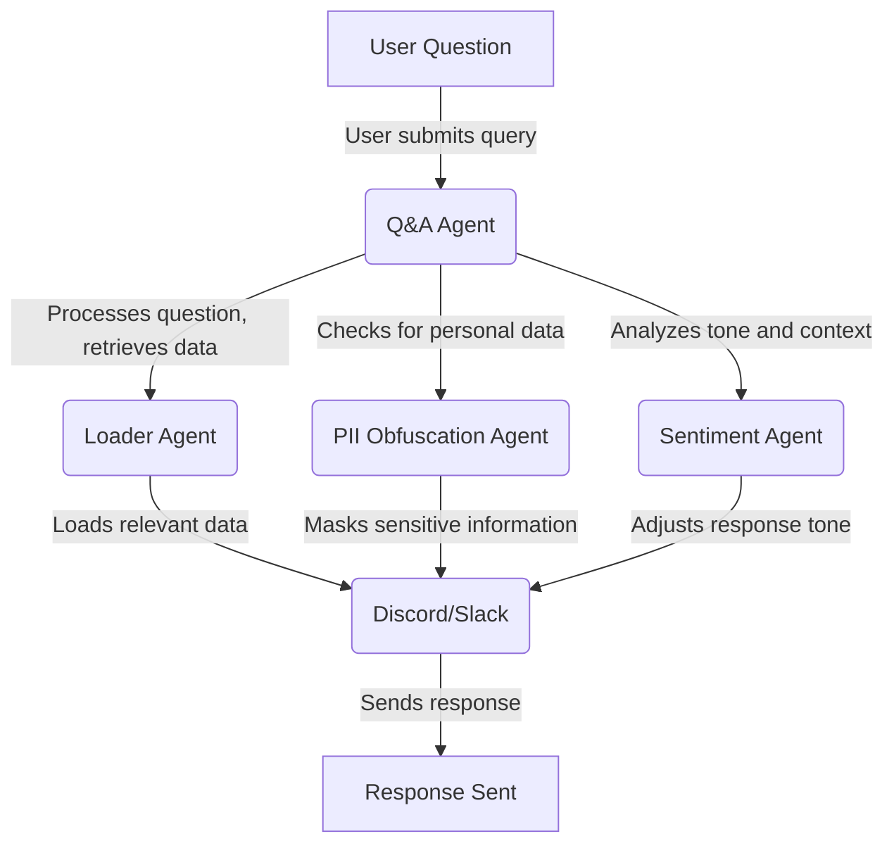

# AI / Web3 - DevRel Workflow Automation: Unlocking Efficiency in Developer Relations

In an open source ecosystems, [Developer Relations (DevRel)](https://developerrelations.com/what-is-developer-relations) has emerged as a critical function for growing and nurturing communities. But as these ecosystems expand in complexity, managing developer engagement, providing timely support, and creating consistent technical content becomes more challenging.

This challenge is compounded by the fact that more users, adopters, and builders doesn't necessarily equal more stable revenue. Despite that, your organisation will be expected to answer questions, update docs, and trouble shoot in a timely manner.

Some organisations are pressured into expanding their teams, and hiring more people to accomodate the growth, this unfortunately causes tension when revenue drops and downsizes are needed.

In the last two years we've seen an [increasing adoption of AI](https://assets-c4akfrf5b4d3f4b7.z01.azurefd.net/assets/2024/05/2024_Work_Trend_Index_Annual_Report_6_7_24_666b2e2fafceb.pdf) to assist dev rels in keeping up with the ever growing demand and list of tasks, we’ll explore how AI-powered automation is redefining DevRel operations across Web3, and how we've seen teams leverage this to boost efficiency, enhance developer experience, and scale engagement effortlessly.

## 1. What is Workflow Automation?

The question of what is a workflow maps to the question: "What is an assembly line?"

> An assembly line is a production process that breaks the manufacture of a good into steps that are completed in a pre-defined sequence.

A workflow is an assembly line producing a specific outcome, **AI agents are responsible for a single task within this workflow.** These tasks range from answering common support questions to automating the production and maintenance of technical content.

Below is an example of a Q&A workflow:

**Key components of a DevRel Workflow Automation system include:**

- **Loader Agents:** Agents which are configured to consume information specific to your organisation, allowing the conversational agents to respond with accurate, and relevant data
- **Conversational Agents:** Agents which are configured to identify and respond to common queries.
- **Content generation:** AI tools that create, update, or recommend technical documentation and blog content.
- **Feedback loops:** Automated systems to collect and analyze developer feedback, providing real-time insights into community sentiment and product needs.
- **Monitoring and analytics:** Dashboards that track developer engagement and measure the effectiveness of documentation or community interactions.

_This shift towards automation empowers devrels to be more agile, responsive, and scalable-while still maintaining a human touch._

## 2. Why Is Workflow Automation Essential for DevRels?

As projects and ecosysems grow, developer communities become more diverse and dispersed. This introduces new challenges for managing developer interactions, addressing support needs, and maintaining up-to-date resources. Here's why automation is becoming a necessity:

### Scaling Support for a Global Developer Base

Web3 and AI projects often attract developers from around the globe, creating a 24/7 need for support. With AI-driven automation, DevRel teams can offer around-the-clock assistance, resolving common queries with chatbots or pre-built FAQs. This ensures developers receive the support they need without overwhelming human teams.

### Keeping Documentation Up to Date

Documentation is a cornerstone of any successful projects, however as a project grows docs will become less relevant. A combination or product growth, internal changes, and community growth requires your organisation allocate significant resources in upkeeping your documentation.

### Developer Onboarding

With product growth, communities follows suit. There will be an inflow of developers and potential customers seeking to onboard onto the codebase/project.

Working through the **logistics of offering human support** and structuring documentation to accomodate for onboarding can be tough, a global audience means the need for multi-lingual support, online team members at varying timezones, and many hours that humans can't keep up with.

### Optimizing Community Feedback and Iteration

Collecting and analyzing developer feedback can be time-intensive, but it’s crucial for improving the developer experience. Automated systems can **gather feedback in real-time**, flagging common pain points, feature requests, or issues with the documentation. DevRel teams can use these insights to make data-driven decisions, improving community engagement and retention.

## 3. How to Automate Your DevRel Workflows

Transitioning to Workflow Automation is all about setting up clear, reproducible processes. Not only can you significantly boost your devrels impact, but you'll be able to gain insight into the workings of your organisation.

**Here are the steps we'll use:**

- Identify High-Volume, Repetitive Tasks
- Document the steps involved in fulfilling these tasks
- Identify the KPIs related to these tasks
- Introduce automations that eliminate the most tedious and predictible elements
- Automate Feedback Loops
- Set Up Monitoring and Analytics

Automating systems can save DevRel teams countless hours of manual tracking. Use AI-powered analytics tools to monitor developer engagement across various touchpoints-whether that’s in your documentation, on social media, or within community forums. Track key metrics such as content performance, issue resolution times, and developer satisfaction scores to make informed decisions.

## 4. Automation Challenges

It's clear that AI is changing the work landscape, but it still comes with significant challenges that _prevent most companies for taking full advantage of these tools._ Most technical individuals can use ChatGPT, Gemini, and Claude to **boost their personal productivity**, but to truly leverage AI to it's full potential requires more than a chat bot.

- Scaling AI and putting it into production environments is costly, and requires significant optimisations and constant monitoring
- Currently AI models have a limited training sets, which cannot be customised to fit your specific needs without fine tuning, you can train a small model or build a RAG, both approaches come with pros-cons and time-cost considerations.
- The sourcing and categorisation of data needs to be close to real-time, which as of now requires custom coded scrapers and integrations.
- Chatbot responses can range from uninformed, to unhelpful, to down-right misleading, without proper accuracy controls relying on AI data can lead to a lot of wasted time.
- Content generation is only a piece of the puzzle, to automate an entire workflow we need many agents which require a lot of custom coding as of now.

Over the last year we've tackled many of these challenges which have been incorporated into the new Katara stack which includes a data enrichment layer combined with vector search and a growing library of AI-enabled agents that can be combined to tackle exceedingly complex workflows.
