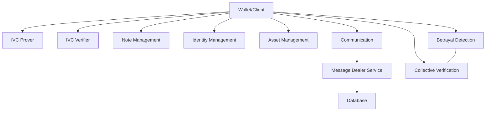

## Background

The **Ethereum Foundation** engaged our team to design and implement a cutting-edge privacy-preserving framework for digital asset management.

The project, **IVCNotes**, explored how **Zero-Knowledge Proofs (ZKPs)** and **Incremental Verifiable Computation (IVC)** could enable private issuance, ownership, and transfer of digital notes—while **Multi-Party Computation (MPC)** was investigated as a way to enhance collective verification and system resilience.

This was a **research + implementation** engagement rather than a pure product build, focused on pushing what’s possible in privacy-preserving crypto systems.

## Objectives

1. **Privacy-Preserving Protocol** – Enable private issuance, ownership, and transfer of digital notes.
2. **MPC Integration Research** – Explore how MPC can provide collective verification without sacrificing privacy.
3. **Concrete Deliverables** – Ship:
   - Protocol designs and research documentation
   - Proof-of-concept implementations
   - A backend service for managing notes and communications
   - Demos that exercise the core flows

## Protocol Development

We designed a cryptographic framework for **IVCNotes** with:

- **Zero-Knowledge Proofs** – Efficient proof generation and verification using Rust + Arkworks.
- **Incremental Verifiable Computation (IVC)** – Chaining ZK proofs across multiple transfers, so verifying long histories stays efficient.
- **Note Lifecycle Management** – UTXO-style note model, with issuance, splitting, and transfer.
- **Double-Spend Protection** – Blinded identifiers (nullifiers) and optional collective betrayal detection to guard against abuse.

## Backend Service

To make the system usable by real participants (not just in theory), we built a backend service responsible for:

- **Data Storage** – Managing identities, notes, and transaction metadata in a secure database.
- **Coordination** – HTTP APIs for interaction between client, prover, and verifier components.
- **Message Dealing** – A message dealer service to route encrypted messages between parties during note issuance and transfer.

## MPC Research Track

In parallel, we explored how **Multi-Party Computation** could be layered onto the protocol:

- **Distributed Verification** – Using MPC to validate notes collectively without revealing the underlying data.
- **Betrayal Detection** – Detecting double-spending in a privacy-preserving way.
- **Threshold Cryptography** – Designing **t-of-n** schemes for fault-tolerant, shared verification.

This work surfaced promising directions, but also real-world constraints around complexity, infrastructure, and coordination.

## Technical Architecture

At a high level, the system ties together wallets, provers, verifiers, and note management, backed by a coordination service.

**Core technologies:**

- **Language:** Rust
- **Libraries:** Arkworks, Poseidon hash
- **Serialization:** Serde
- **Database:** MongoDB for persistence

## Results

### Functional PoC

We shipped a **working proof-of-concept** that demonstrated:

- Private note issuance and transfer flows
- Efficient ZK proof generation and verification
- A CLI experience for managing notes and interacting with the system

### Documentation & Demos

- Protocol and architecture documentation describing circuits, flows, and threat models
- Live demos showing:
  - Privacy-preserving transactions
  - Double-spend resistance
  - How MPC could plug into the verification story

### Key Outcomes

- Validated the feasibility of combining **ZKPs + IVC** for privacy-preserving digital assets.
- Identified both the **promise and cost** of deeper MPC integration.

## Challenges & Lessons Learned

### Challenges

1. **Performance** – Proof generation for large-scale scenarios required careful tuning and circuit design.
2. **MPC Complexity** – Coordinating MPC with existing ZK systems adds non-trivial infrastructure overhead.
3. **Operational Overhead** – Nullifier management and double-spend detection in decentralized settings is subtle.

### Lessons

1. Hybrid architectures (ZK + IVC + MPC) offer strong guarantees, but must be engineered for **real-world scale**.
2. **Modularity and documentation** are essential when dealing with advanced cryptography.
3. Early collaboration with cryptography experts avoids dead ends later.

## Future Work

- **Enhanced Privacy:** Stealth addresses and richer note types.
- **MPC Optimization:** Custom, use-case-specific MPC protocols.
- **Scalability:** Faster proving, better parallelization.
- **On-Chain Integration:** Smart contracts for on-chain settlement and coordination.
- **UX:** Move from CLI-first to developer and end-user friendly interfaces.

---

This case study captures the kind of deep R&D work that **0xSero** gravitates toward: taking bleeding-edge cryptographic ideas and driving them toward **practical, implementable systems**.

You can explore more low-level cryptography and protocol experiments via 0xSero’s GitHub profile at https://github.com/0xSero and broader Sybil Solutions code at https://github.com/Seroxdesign.
