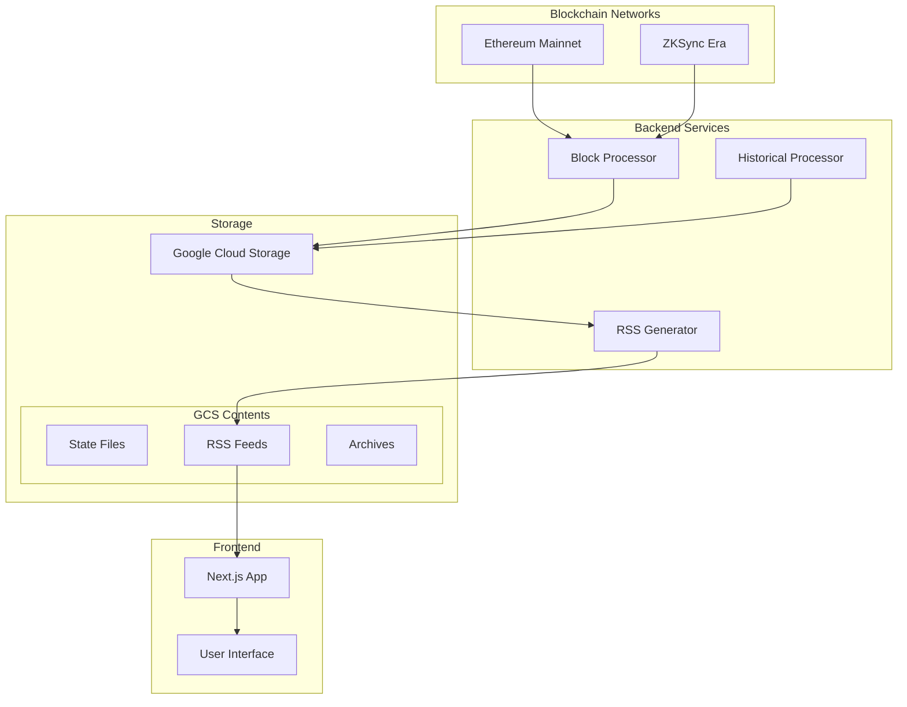

## Project Overview

The **ZKSync & Ethereum Governance Event Monitor** project created a transparent, scalable monitoring system for governance events on **ZKSync Era** and **Ethereum Mainnet**.

By transforming low-level blockchain events into structured RSS feeds, stakeholders and developers get **real-time, human-readable insight** into governance activity—without having to run their own indexers.

This was delivered in a **one‑month sprint**, with implementation support from **ScopeLift**.

## Objectives

1. **Governance Event Tracking** – Capture proposal creation, execution, cancellation, and core admin changes.
2. **RSS Feed Integration** – Present events as easy‑to‑consume, continuously updated RSS feeds.
3. **Scalable & Reliable Architecture** – Use GCP + Docker for predictable, cloud‑native deployment.
4. **Transparent Monitoring** – Keep structured historical archives so past events stay discoverable.

## System Architecture

The system is composed of blockchain listeners, processing services, storage, and a lightweight front-end.

### Key Features

- **Event Detection:** Batch processing of governance events for efficiency and resilience.
- **RSS Feeds:** Human-friendly feeds for proposals, executions, cancellations, and admin changes.
- **Scalability:** Designed for **150k+ daily RPC calls** across ZKSync Era and Ethereum.

## Core Functionalities

### 1. Event Monitoring

- Tracks governance events like proposal creation, execution, cancellation, and role/admin updates.
- Supports both **Ethereum Mainnet** and **ZKSync Era** with unified logic.

### 2. RSS Feed Integration

- Converts structured events into RSS feeds that **update automatically**.
- Archives older entries so historical governance activity remains accessible.

### 3. Infrastructure

- **Cloud Platform:** Google Cloud Platform for storage and processing.
- **Containerization:** Docker images for reproducible deployments.
- **Frontend:** Next.js app to surface feeds and status pages.

## Challenges & Solutions

### Tight Timeline

- **Challenge:** Shipping a production-ready monitor in **one month**.
- **Solution:** A focused roadmap, daily syncs with ScopeLift, and early alignment on the “MVP that matters” ensured fast iteration without scope creep.

### High RPC Usage

- **Challenge:** Handling high call volumes without hitting rate limits or exploding costs.
- **Solution:** Batched requests, tuned polling intervals, and idempotent processing reduced load while maintaining freshness.

### Scalability

- **Challenge:** Ensuring the system could scale as governance and usage grew.
- **Solution:** Stateless workers + GCP storage allowed horizontal scaling and easy maintenance.

### Error Handling

- **Challenge:** Dealing with transient and permanent errors from RPC providers.
- **Solution:** Clear retry logic, backoff strategies, and logging/alerting pipelines to keep operators informed.

## Results

1. **Functional Monitoring System**

   - Real-time coverage of governance events on **Ethereum Mainnet** and **ZKSync Era**.
   - Fresh RSS feeds and archived historical data for long-term transparency.

2. **Scalable, Cloud-Native Architecture**

   - GCP + Docker enable scaling to more chains or higher event volume with minimal friction.

3. **Stakeholder Value**

   - Core contributors, delegates, and integrators get a **single source of truth** for governance events.

4. **Delivered On Time**
   - All core features shipped within the one‑month window, with a clean handoff.

## Technical Highlights

- **Event Monitoring Rate:**
  - ZKSync Era: **80,000–160,000 calls/day**
  - Ethereum Mainnet: **5,000–10,000 calls/day**
- **Error Handling:**
  - Automatic retries for transient errors
  - Detailed logs and alerts for persistent issues
- **Performance:**
  - Block processing latency: **< 1s per block**
  - RSS updates roughly every **5 minutes**

## Lessons Learned

1. **Modular Design Wins** – Clean separation of the block processor, historical backfill, and RSS generator made iteration and debugging straightforward.
2. **Cloud-Native by Default** – Leaning on GCP for storage and compute simplified deployment and scaling.
3. **Collaboration Matters** – Working with ScopeLift brought in domain and governance best practices early.

## Future Recommendations

- **UI Enhancements:** Build richer dashboards for visualizing proposals, timelines, and actor actions.
- **More Chains:** Extend to additional L2s and governance frameworks.
- **Analytics:** Add trend analysis, activity heatmaps, and alerting.
- **Community Education:** Publish guides and host workshops to help others build on similar patterns.

---

This case study reflects how work from **0xSero** focuses on **transparent, production-grade blockchain infrastructure**—the kind of plumbing that quietly powers real governance and coordination.

For more related infrastructure and experiments, see the public work on GitHub at https://github.com/0xSero and the Sybil Solutions site code at https://github.com/Seroxdesign.
